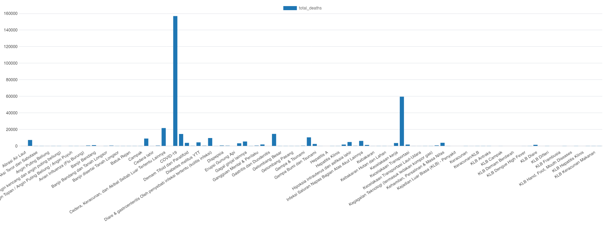
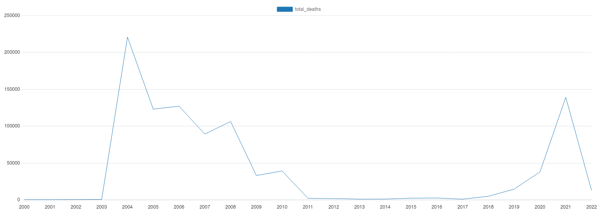
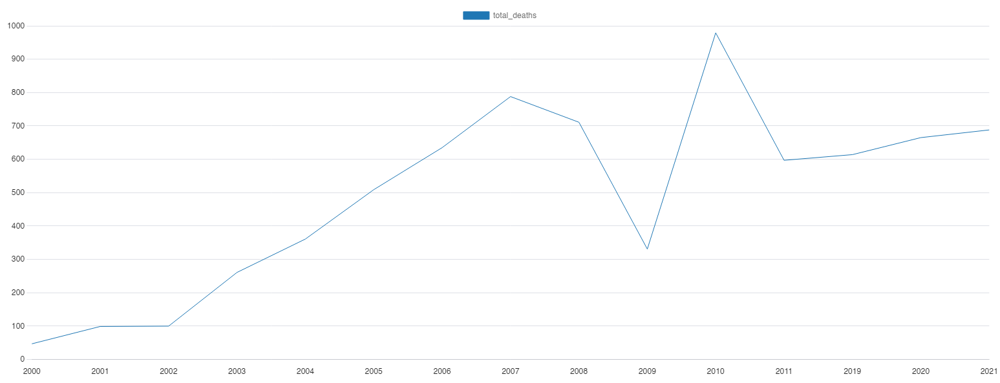
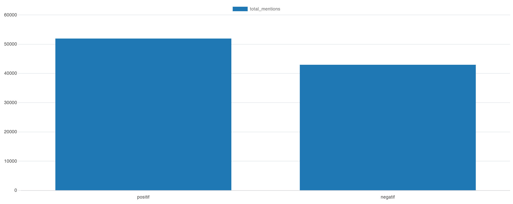
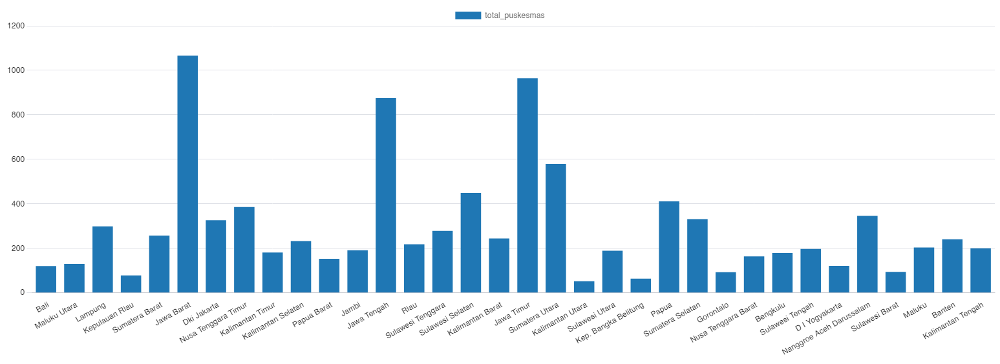
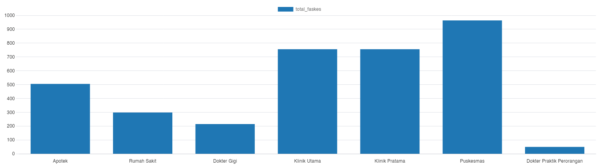
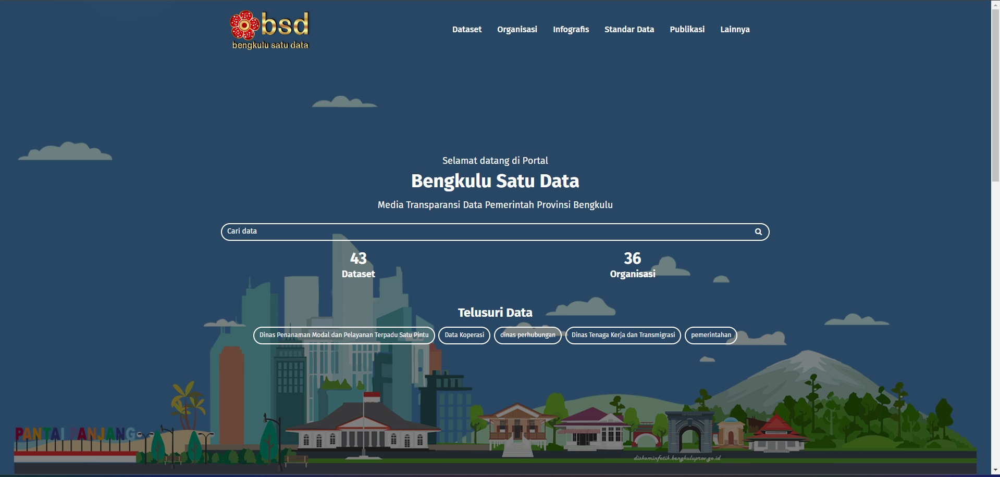
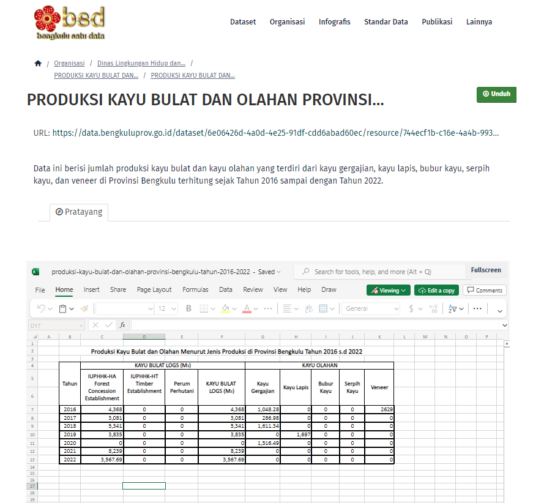
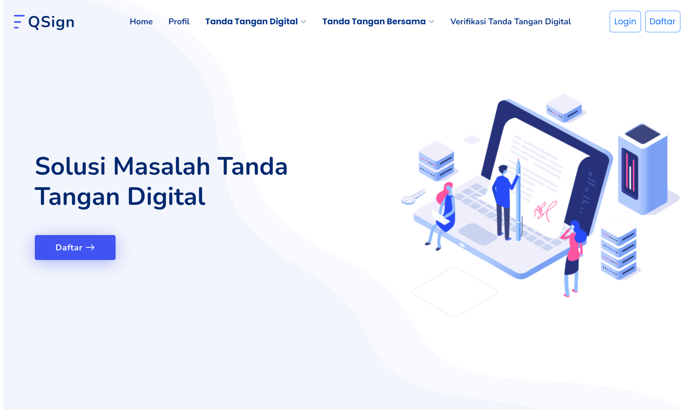
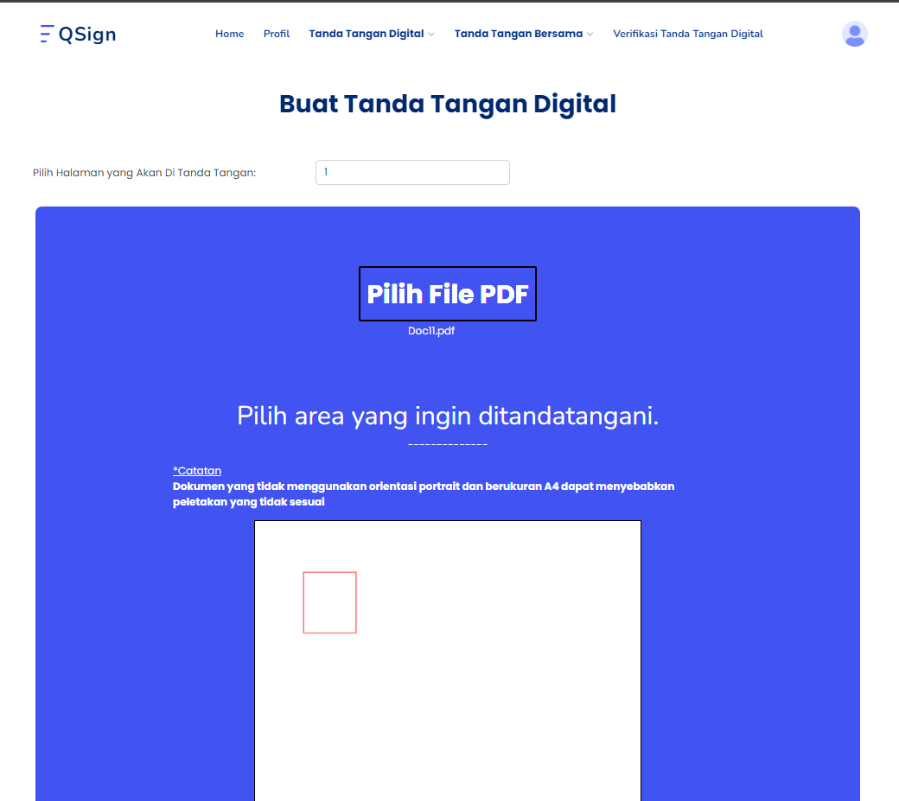

# Portofolio
# About
Hello, I'm Aditya Rizki Ananda, a fresh graduate eager to embark on a career path focused on managing data warehouses and leveraging SQL to extract insights from complex datasets. While my formal education may be recent, I have dedicated myself to mastering SQL, recognizing its pivotal role in data management systems. Proficient in crafting complex queries, optimizing database performance, and ensuring data integrity, I am equipped to transform raw data into actionable insights.

I'm also eager to learn more about Extract, Transform, Load (ETL) processes, understanding their significance in data integration and workflow automation. Despite being a fresh graduate, my recent experience as a web developer contracted for a governmental data management site has provided me with invaluable insights into database management principles and solidified my passion for data-driven solutions.

In my spare time, I'm continually expanding my SQL skills, exploring advanced techniques, and staying abreast of industry best practices. Whether it's fine-tuning database structures or streamlining ETL processes, I thrive on the challenge of optimizing data workflows and driving efficiency.

As I transition into the workforce, I am excited to leverage my technical expertise and SQL proficiency to contribute meaningfully in the field of data warehouse management. From designing robust data architectures to implementing effective data governance strategies, I am committed to delivering impactful solutions that maximize the value of data assets.

My [CV](https://github.com/Adtyra/Portofolio/blob/main/CV_Aditya%20Rizki%20Ananda.pdf).

This is a repository to showcase skills and my projects from graduation project until now.
# Table of Contents
* [About](#about)
* [Projects]
  * Data Analyst
    - [ ] [Top 5 Province With Most Favorable Living Cost In Year 2021 and 2022](#top-5-province-with-most-favorable-living-cost-in-year-2021-and-2022)
  * SQL Projects
    - [ ] [Reported Cause Of Death In Indonesia](#reported-cause-of-death-in-indonesia)
    - [ ] [Gojek Review](#gojek-review)
    - [ ] [BPJS Health Facility](#bpjs-facility)
  * Last Project
    - [ ] [Satu Data Indonesia Provinsi Bengkulu](#satu-data-indonesia-provinsi-bengkulu)
  * Graduation Project
    - [ ] [ECDSA Based Digital Signature with QR Code Verification](#ecdsa-based-digital-signature-with-qr-code-verification)
* [Education](#education)
* [Certificates](#certificates)
* [Contacts](#contacts)

# Projects
## Top 5 Province With Most Favorable Living Cost In Year 2021 and 2022
   Description: The project aims to
   [Data Source](https://www.kaggle.com/datasets/hendratno/cause-of-death-in-indonesia)
## Reported Cause Of Death In Indonesia
  Description: The dataset contains records of Reported Cause of Death in Indonesia
  [Data Source](https://www.kaggle.com/datasets/hendratno/cause-of-death-in-indonesia)
  - [ ] [SQL Code](Files/Reported_death/Cause_of_death.sql)
  1. Reported Cause of Death
     The SQL [Result](Files/Reported_death/Cause_of_death.csv) 
     
  2. Death Count by Year
     The SQL [Result](Files/Reported_death/Death_per_Year.csv) 
     
  3. Death Cause by AIDS
     The SQL [Result](Files/Reported_death/AIDS_Year) 
     
     
## Gojek Review
  Description: The dataset contains records of Gojek app review from google play store.
  [Data Source](https://www.kaggle.com/datasets/ucupsedaya/gojek-app-reviews-bahasa-indonesia)
  - [ ] [SQL Code](Files/Gojek/Gojek_Review.sql)
  1. Rating per Year
     The SQL [Result](Gojek/rating_year.csv)  
     | Year | Average Rating | Total Reviews |
     |------|----------------|---------------|
     | 2024 | 3.66           | 6824          |
     | 2023 | 3.67           | 65584         |
     | 2022 | 4.06           | 124420        |
     | 2021 | 4              | 28174         |
  2. Rating per Month
     The SQL [Result](Files/Gojek/rating_month.csv) 
     
  3. User Sentiment
     The SQL [Result](Files/Gojek/sentiment.csv) 
     
     
## BPJS Facility
  Description: The dataset contains records of Health Facility of BPJS Indonesia
  [Data Source](https://www.kaggle.com/datasets/israhabibi/list-faskes-bpjs-indonesia)
  - [ ] [SQL Code](Files/BPJS/Faskes_BPJS.sql)
  1. Hospital per Province
     The SQL [Result](Files/BPJS/Rumah_Sakit.csv) 
     
  2. Health Center per Province
     The SQL [Result](Files/BPJS/Puskesmas.csv) 
     
  3. All Health Facility in East Java
     The SQL [Result](Files/BPJS/Faskes_Jatim.csv) 
     

## [Satu Data Indonesia Provinsi Bengkulu](data.bengkuluprov.go.id)
   
   Satu Data Indonesia is a national scale project to link data across Indonesia. The web features a hierarchical structure: the national platform holds data from all provinces and cities, while each province and city maintains its own platform, hosting relevant data at their respective administrative levels. 
   
   

     
   

   The data stored on these platforms can take various formats, but the most prevalent one is XLSX, a format commonly associated with Microsoft Excel.
   
## ECDSA Based Digital Signature with QR Code Verification
   

     
   

   My graduation project tackles the issue of signature forgery in online learning environments. I developed a digital signature website utilizing ECDSA-based signatures wrapped in QR codes for enhanced security. This innovation allows users to verify signatures via QR scan or document upload, ensuring authenticity and expediting approvals, even when lecturers are off-campus. By addressing these challenges, the project aims to streamline the document signing process in remote academic settings. 
   
  

     
  

  The QR code's placement within documents is customizable, facilitating compatibility with diverse formats. This adaptability ensures seamless verification across a range of document types, enhancing system usability. 
  

    
  

   
# Education
  University of Bengkulu, Bachelor's degree, Computer Science Aug 2018 - May 2023
# Certificates 
  Orbit Future Academy [AWS re/Start](https://erp.orbitfutureacademy.com/pub/certificate/verification/ORBITFA65aa4eab61f2d) December 15, 2023. 
  MySkill [Data Analysis](https://storage.googleapis.com/myskill-v2-certificates/topic-qtKMZ78xyd6TPzUQOESu/Z6ENhCALhdSnXY189i96CdGRizR2-kYyaEvdl7FkRTetjQtbi.pdf) September 22, 2023. 
  Coursera [Google Data Analytics](https://coursera.org/verify/professional-cert/QJSHFRDTCHPP) August 25, 2023. 
  
# Contacts
  Linkedin : [Aditya Rizki Ananda](https://www.linkedin.com/in/adityarizkiananda/) 
  Email : adityarizkiand@gmail.com
