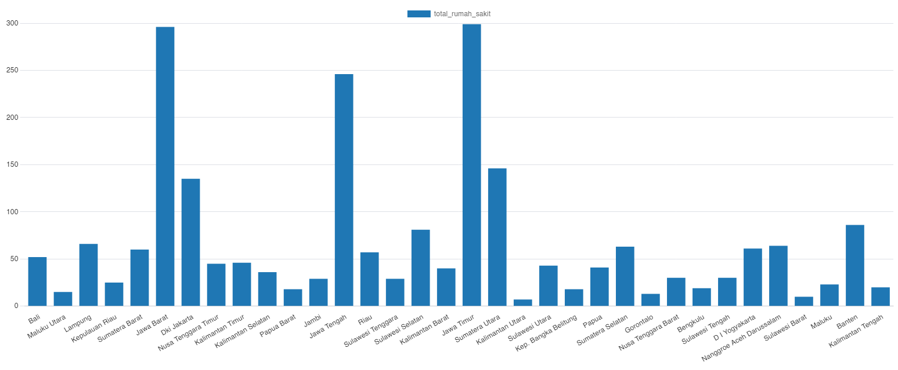
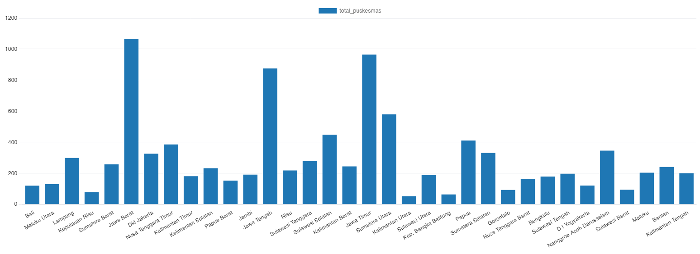
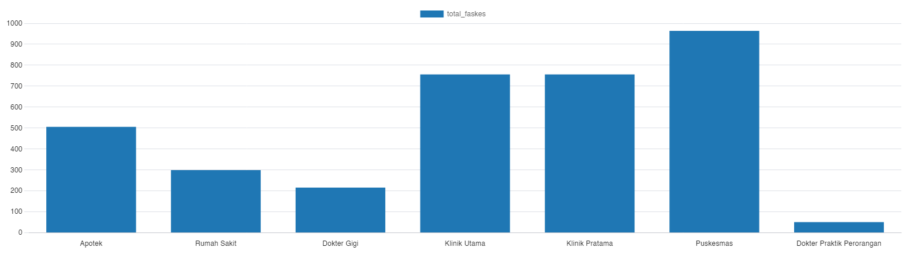
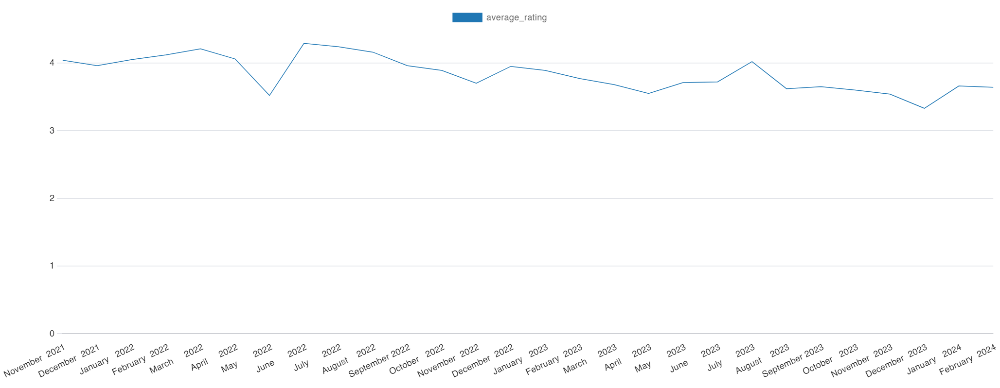
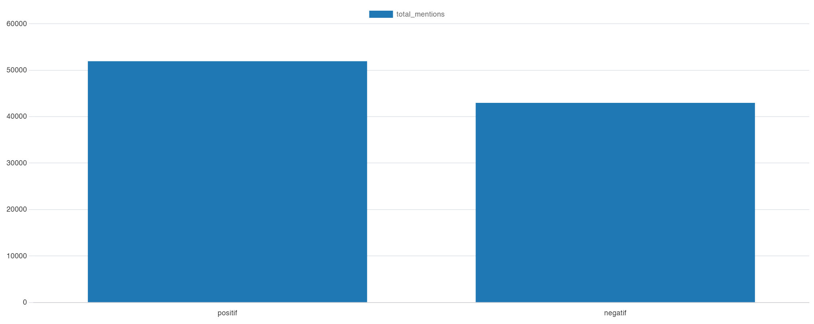

# Portofolio
# About
Hello, I'm Aditya Rizki Ananda, a fresh graduate eager to embark on a career path focused on managing data warehouses and leveraging SQL to extract insights from complex datasets. While my formal education may be recent, I have dedicated myself to mastering SQL, recognizing its pivotal role in data management systems. Proficient in crafting complex queries, optimizing database performance, and ensuring data integrity, I am equipped to transform raw data into actionable insights.

I'm also eager to learn more about Extract, Transform, Load (ETL) processes, understanding their significance in data integration and workflow automation. Despite being a fresh graduate, my recent experience as a web developer contracted for a governmental data management site has provided me with invaluable insights into database management principles and solidified my passion for data-driven solutions.

In my spare time, I'm continually expanding my SQL skills, exploring advanced techniques, and staying abreast of industry best practices. Whether it's fine-tuning database structures or streamlining ETL processes, I thrive on the challenge of optimizing data workflows and driving efficiency.

As I transition into the workforce, I am excited to leverage my technical expertise and SQL proficiency to contribute meaningfully in the field of data warehouse management. From designing robust data architectures to implementing effective data governance strategies, I am committed to delivering impactful solutions that maximize the value of data assets.

My [CV](https://github.com/Adtyra/Portofolio/blob/main/CV_Aditya%20Rizki%20Ananda.pdf).

This is a repository to showcase skills and my projects from graduation project until now.
# Table of Contents
* [About](https://github.com/Adtyra/Portofolio/blob/main/README.md#about)
* Projects
  * SQL Projects
    - [ ] [Gojek Review](www.example.com)
    - [ ] [Fasilitas Kesehatan BPJS](www.example.com)
    - [ ] [Penyebab Kematian di Indonesia](www.example.com)
  * Last Project
    - [ ] [Satu Data Indonesia Provinsi Bengkulu](www.example.com)
  * Graduation Project
    - [ ] [ECDSA Digital Signature with QR Code Access](www.example.com)
* [Education]
* [Certificates]
* [Contacts]

# Projects
## Reported Cause Of Death In Indonesia
  Description: The dataset contains records of Health Facility of BPJS Indonesia
  [Data Source](https://www.kaggle.com/datasets/israhabibi/list-faskes-bpjs-indonesia)
  - [ ] [SQL Code](BPJS/Faskes_BPJS.sql)
  1. Hospital per Province
     The SQL [Result](BPJS/Rumah_Sakit.csv) 
     
  2. Health Center per Province
     The SQL [Result](BPJS/Puskesmas.csv) 
     
  3. All Health Facility in East Java
     The SQL [Result](BPJS/Faskes_Jatim.csv) 
     
     
## Gojek Review
  Description: The dataset contains records of Gojek app review from google play store.
  [Data Source](https://www.kaggle.com/datasets/ucupsedaya/gojek-app-reviews-bahasa-indonesia)
  - [ ] [SQL Code](Gojek/Gojek_Review.sql)
  1. Rating per Year
     The SQL [Result](Gojek/rating_year.csv)  
     | Year | Average Rating | Total Reviews |
     |------|----------------|---------------|
     | 2024 | 3.66           | 6824          |
     | 2023 | 3.67           | 65584         |
     | 2022 | 4.06           | 124420        |
     | 2021 | 4              | 28174         |
  2. Rating per Month
     The SQL [Result](Gojek/rating_month.csv) 
     
  3. User Sentiment
     The SQL [Result](Gojek/sentiment.csv) 
     
     
## BPJS Facility
  Description: The dataset contains records of Health Facility of BPJS Indonesia
  [Data Source](https://www.kaggle.com/datasets/israhabibi/list-faskes-bpjs-indonesia)
  - [ ] [SQL Code](BPJS/Faskes_BPJS.sql)
  1. Hospital per Province
     The SQL [Result](BPJS/Rumah_Sakit.csv) 
     
  2. Health Center per Province
     The SQL [Result](BPJS/Puskesmas.csv) 
     
  3. All Health Facility in East Java
     The SQL [Result](BPJS/Faskes_Jatim.csv) 
     

# Education
# Contacts
